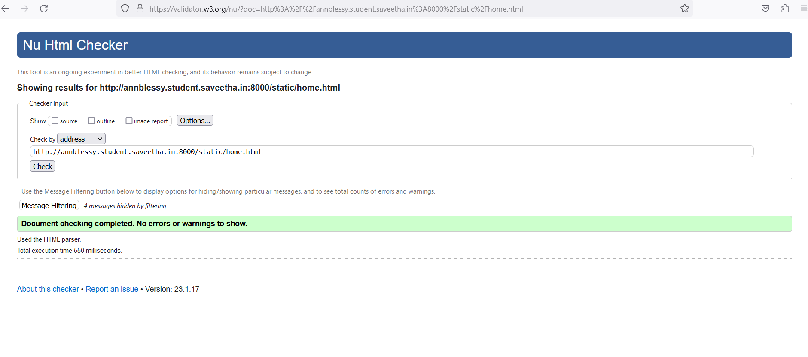

# Web Design for a Software Product Company

## AIM:

To design a static website for a software product company company.

## DESIGN STEPS:

### Step 1:

Requirement collection.

### Step 2:

Creating the layout using HTML and CSS.

### Step 3:

Updating the sample content.

### Step 4:

Choose the appropriate style and color scheme.

### Step 5:

Validate the layout in various browsers.

### Step 6:

Validate the HTML code.

### Step 6:

Publish the website in the given URL.

## PROGRAM :
### layout.css
```
* {
  box-sizing: border-box;
  font-family: Arial, Helvetica, sans-serif;
}
body {
  background-color: whitesmoke;
  color: #17421d;
}
.container {
  width: 780px;
  margin-left: auto;
  margin-right: auto;
  border-width: 1px 1px 1px 1px;
  border-style: solid;
  box-shadow: 15px 15px 8px gray;
}

.banner {
  display: block;
  width: 97%;
  height: 220px;
  text-align: center;
  font-size: 60px;
  background-image: url("/static/img/google-logo.jpg");
  background-size: 99% 110%;
  margin: 0px 0px 0px 0px;
  padding-top: 150px;
  color: #16d1ae;
}

.menu {
  display: block;
  width: 100%;
  height: 50px;
  font-size: larger;
  background-color: #767ffa;
  text-align: center;
  padding-top: 15px;
  margin: 0px 0px 0px 0px;
  border-width: 1px;
}

.menuitem {
  display: inline-block;
  margin-left: 10px;
  margin-right: 10px;
}
.menuitemselected {
  display: inline-block;
  margin-left: 10px;
  margin-right: 10px;
  color: #16d1ae;
}

.menuitem a {
  text-decoration: none;
  color: #310608;
}

.content {
  display: block;
  width: 100%;
  background-color: #cffffd;
  min-height: 500px;
  margin: 0px 0px 0px 0px;
  border-width: 1px;
  border-color: white;
  border-style: solid;
}
.homecontent {
  min-height: 550px;
  margin: 10px 10px 10px 10px;
}
.homecontent h1 {
  text-align: left;
  font-family: Cambria, Cochin, Georgia, Times, 'Times New Roman', serif;
  font-size: xx-large;
}
.homecontent img {
  float: right;
  width: 320px;
  height: 150px;
  margin-left: 10px;
}

.contenttext {
  text-align: justify;
  font-family: Cambria, Cochin, Georgia, Times, 'Times New Roman', serif;
  font-style: italic;
  font-size: larger;
  color: #310d52;
}

.productcontent {
  min-height: 500px;
  margin: 10px 10px 10px 10px;
}

.productcontent h1 {
  text-align: left;
  font-family: Cambria, Cochin, Georgia, Times, 'Times New Roman', serif;
  font-size: xx-large;
}

.productitems {
  display: block;
}

.productitem {
  display: inline-block;
  width: 30%;
  height: 250px;
  text-align: center;
}

.productitem img {
  width: 140px;
  height: 95px;
  display: block;
}
.productitem .itemimage {
  display: block;
  margin-left: auto;
  margin-right: auto;
  width: 100px;
  margin-bottom: 10px;
}

.productitem .itemname {
  display: block;
  text-decoration: #310608;
  font-family: 'Lucida Sans', 'Lucida Sans Regular', 'Lucida Grande', 'Lucida Sans Unicode', Geneva, Verdana, sans-serif;
  font-size: larger;
  font-weight: 1000px;
}
.productitem .itemprice {
  display: block;
  font-family: Georgia, 'Times New Roman', Times, serif;
  font-style: italic;
  font-size: large;
}

.peoplecontent {
  min-height: 500px;
  margin: 10px 10px 10px 10px;
}

.peoplecontent h1 {
  text-align: left;
}

.peopletitems {
  display: block;
}

.peopleitem {
  display: inline-block;
  width: 30%;
  height: 250px;
  text-align: center;
}

.peopleitem img {
  width: 110px;
  height: 133px;
  display: block;
}
.peopleitem .itemimage {
  display: block;
  margin-left: auto;
  margin-right: auto;
  width: 100px;
  margin-bottom: 10px;
}

.peopleitem .itemname {
  display: block;
  text-decoration: #310608;
  font-family: 'Lucida Sans', 'Lucida Sans Regular', 'Lucida Grande', 'Lucida Sans Unicode', Geneva, Verdana, sans-serif;
  font-size: larger;
  font-weight: 1000px;
}
.peopleitem .itemprice {
  display: block;
  font-family: Georgia, 'Times New Roman', Times, serif;
  font-style: italic;
}
.contactcontent {
  min-height: 550px;
  margin: 10px 10px 10px 10px;
}
.contactcontent h1 {
  text-align: left;
  font-family: Cambria, Cochin, Georgia, Times, 'Times New Roman', serif;
  font-size: xx-large;
}
.contactcontent img {
  float: center;
  width: 70px;
  height: 90px;
  margin-left: 10px;
}
.footer {
  display: block;
  width: 100%;
  height: 40px;
  background-color: #66bed4;
  text-align: center;
  padding-top: 10px;
  margin: 0px 0px 0px 0px;
  color: #4b1215;
}
```
### home.html
```
<!DOCTYPE html>
<html lang="en">
  <head>
    <title>Google .co</title>
    <link rel="stylesheet" href="./css/layout.css" />
    <link rel="icon" href="./img/icon.png" type="image/x-icon" />
  </head>

  <body>
    <div class="container">
      <div class="banner"></div>
      <div class="menu">
        <div class="menuitemselected"><a href="/static/home.html">Home</a></div>
        <div class="menuitem"><a href="/static/products.html">Products</a></div>
        <div class="menuitem"><a href="/static/people.html">People</a></div>
        <div class="menuitem"><a href="/static/contact.html">Contact Us</a></div>
      </div>
      <div class="content">
        <div class="homecontent">
          <h1>About Us</h1>
          <div class="contenttext">
            Google LLC is an American multinational technology company focusing on search engine technology, online advertising, cloud computing,
            computer software, quantum computing, e-commerce, artificial intelligence, and consumer electronics. It has been referred to as "the most powerful company in the world"
            and one of the world's most valuable brands due to its market dominance, data collection, and technological advantages in the area of artificial intelligence.<br>
            <br>
            Google was founded on September 4, 1998, by Larry Page and Sergey Brin while they were PhD students at Stanford University in California.  
            The company went public via an initial public offering (IPO) in 2004.
            Sundar Pichai was appointed CEO of Google on October 24, 2015, replacing Larry Page, who became the CEO of Alphabet. 
            On December 3, 2019, Pichai also became the CEO of Alphabet.
            <br>
            The company has since rapidly grown to offer a multitude of products and services beyond Google Search, many of which hold dominant market positions.
            Discontinued Google products include gaming (Stadia), Glass, Google+, Reader, Play Music, Nexus, Hangouts, and Inbox by Gmail.
            <br>
            
            <ul>
              <li>GOOGLE: Global Organization of Oriented Group Language of Earth.</li>
              <li>Insightful , actionable & customizable reports</li>
              <li>Anywhere, anytime and secure access</li>
              <li>Very useful worldwide resource sharing site</li>
            </ul>
          </div>
        </div>
      </div>
      <div class="footer">
        Copyright &#169; 2021 Google software site, Developed by Ann Blessy.
      </div>
    </div>
  </body>
</html>
```
### products.html
```
<!DOCTYPE html>
<html lang="en">
  <head>
    <title>google .co</title>
    <link rel="stylesheet" href="./css/layout.css" />
    <link rel="icon" href="./img/icon.png" type="image/x-icon" />
  </head>

  <body>
    <div class="container">
      <div class="banner"></div>
      <div class="menu">
        <div class="menuitem"><a href="/static/home.html">Home</a></div>
        <div class="menuitemselected">
          <a href="/static/products.html">Products</a>
        </div>
        <div class="menuitem"><a href="/static/people.html">People</a></div>
        <div class="menuitem"><a href="/static/contact.html">Contact Us</a></div>
      </div>
      <div class="content">
        <div class="productcontent">    
          <h1>Our Premium Products</h1>
          <div class="productitems">
              <div class="productitem"> 
                  <div class="itemimage">
                  
                  </div>
                  <div class="itemname">Google Maps</div>
                  <div class="itemprice">Free source</div>
              </div>
              <div class="productitem"> 
                  <div class="itemimage">
                  
                  </div>
                  <div class="itemname">Google Chrome</div>
                  <div class="itemprice">Free source</div>
              </div>
              <div class="productitem"> 
                  <div class="itemimage">
                  
                  </div>
                  <div class="itemname">Google Play</div>
                  <div class="itemprice">Free source</div>
              </div>
              <div class="productitem"> 
                  <div class="itemimage">
                  
                  </div>
                  <div class="itemname">Google Drive</div>
                  <div class="itemprice">Free source</div>
              </div>
              <div class="productitem"> 
                  <div class="itemimage">
                  
                  </div>
                  <div class="itemname">Gmail</div>
                  <div class="itemprice">Free source</div>
              </div>
              <div class="productitem"> 
                  <div class="itemimage">
                  
                  </div>
                  <div class="itemname">Google meet</div>
                  <div class="itemprice">Free source</div>
                  <div class="itemprice">(Paid for Premium)</div>
              </div>
              <div class="productitem"> 
                  <div class="itemimage">
                  
                  </div>
                  <div class="itemname">Google calender</div>
                  <div class="itemprice">Free source</div>
              </div>
              <div class="productitem"> 
                  <div class="itemimage">
                  
                  </div>
                  <div class="itemname">Google assistant</div>
                  <div class="itemprice">Free source</div>
              </div>
              <div class="productitem"> 
                  <div class="itemimage">
                  
                  </div>
                  <div class="itemname">Google Cloud</div>
                  <div class="itemprice">Free source</div>
                  <div class="itemprice">(Paid for additional MB)</div>
              </div>
              <div class="productitem"> 
                  <div class="itemimage">
                  
                  </div>
                  <div class="itemname">Google domain</div>
                  <div class="itemprice">Free source</div>
              </div>
              <div class="productitem"> 
                  <div class="itemimage">
                  
                  </div>
                  <div class="itemname">Google My bussiness</div>
                  <div class="itemprice">Free source</div>
                  <div class="itemprice">(Paid for Premium)</div>
              </div>
              <div class="productitem"> 
                  <div class="itemimage">
                  
                  </div>
                  <div class="itemname">Google analytics</div>
                  <div class="itemprice">Free source</div>
                  <div class="itemprice">(Paid for Premium)</div>
              </div>
          </div>
          </div>        
      </div>
      <div class="footer">
        Copyright &#169; 2021 Google Software site, Developed by Ann Blessy.
      </div>
    </div>
  </body>
</html>
```
### people.html
```
<!DOCTYPE html>
<html lang="en">
  <head>
    <title>google .co</title>
    <link rel="stylesheet" href="./css/layout.css" />
    <link rel="icon" href="./img/icon.png" type="image/x-icon" />
  </head>

  <body>
    <div class="container">
      <div class="banner"></div>
      <div class="menu">
        <div class="menuitem"><a href="/static/home.html">Home</a></div>
        <div class="menuitem"><a href="/static/products.html">Products</a></div>
        <div class="menuitemselected">
          <a href="/static/people.html">People</a>
        </div>
        <div class="menuitem"><a href="/static/contact.html">Contact Us</a></div>
      </div>
      <div class="content">
        <div class="peoplecontent">    
          <h1></h1>
          <div class="peopleitems">
              <div class="peopleitem"> 
                  <div class="itemimage">
                  
                  </div>
                  <div class="itemname">Head HR Manager</div>
                  <div class="itemprice">[John Davis]</div>
              </div>
              <div class="peopleitem"> 
                  <div class="itemimage">
                  
                  </div>
                  <div class="itemname">CEO</div>
                  <div class="itemprice">[Clare Finny]</div>
              </div>
              <div class="peopleitem"> 
                  <div class="itemimage">
                  
                  </div>
                  <div class="itemname">CTO</div>
                  <div class="itemprice">[Anna Betsy]</div>
              </div>
              <div class="peopleitem"> 
                  <div class="itemimage">
                  
                  </div>
                  <div class="itemname">CFO</div>
                  <div class="itemprice">[Markus Joey]</div>
              </div>
              <div class="peopleitem"> 
                  <div class="itemimage">
                  
                  </div>
                  <div class="itemname">Devops Architect</div>
                  <div class="itemprice">[Bethany]</div>
              </div>
              <div class="peopleitem"> 
                  <div class="itemimage">
                  
                  </div>
                  <div class="itemname">Solution Architect</div>
                  <div class="itemprice">[Samuel Glenn]</div>
              </div>
          </div>
          </div>        
      </div>
      <div class="footer">
        Copyright &#169; 2021 Google Software site, Developed by Ann Blessy.
      </div>
    </div>
  </body>
</html>
```
### contact.html
```
<!DOCTYPE html>
<html lang="en">
  <head>
    <title>Google .co</title>
    <link rel="stylesheet" href="./css/layout.css" />
    <link rel="icon" href="./img/icon.png" type="image/x-icon" />
  </head>

  <body>
    <div class="container">
      <div class="banner"></div>
      <div class="menu">
        <div class="menuitem"><a href="/static/home.html">Home</a></div>
        <div class="menuitem"><a href="/static/products.html">Products</a></div>
        <div class="menuitem"><a href="/static/people.html">People</a></div>
        <div class="menuitemselected">
          <a href="/static/contact.html">Contact Us</a>
        </div>
      </div>
      <div class="content">
        <div class="contactcontent">
          <h1>Contact Details</h1>
          <div class="contenttext">
              <p>
                  AMR Tech Park II,No.23 & 24,<br> 
                  Hongasandra, Hosur Main Road, <br>
                  Bangalore 560 068, India<br>
                  Customer Care:1800 309 8859<br>
                </p>
                <hr>
              <ul type='square'>
              <hr size="4" width="3">
              <li>Contact no: +919894721584 /+918956231477</li><br>
              <li>Email id: googleweb@gmail.com</li>
            </ul>
            <br>
            <p>You may also contact us through ....</p>
            <ul>
                <li>Facebook</li>
                <li>Twitter</li>
                <li>Instagram</li>
                <li>WhatsApp</li>
                <li>LinkdIn</li>
            </ul>
                    
          </div>
        </div>
      </div>
      <div class="footer">
        Copyright &#169; 2021 Google software site, Developed by Ann Blessy.
      </div>
    </div>
  </body>
</html>
```
## OUTPUT:
### Home Page:


### Product Page (12 products):


### People Page:


### Contact Page:


### HTML Validation:


### layout.css Validation:


## Result:

Thus a website is designed for the software product company and the HTML,CSS code are validated.
